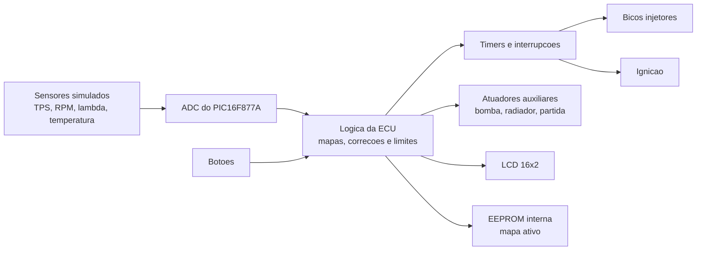

# ECU com PIC16F877A

Projeto academico desenvolvido para a disciplina de **Microprocessadores e
Microcontroladores** do curso de Engenharia de Computacao da UFSC. A proposta
foi construir uma ECU didatica para simular o controle basico de um motor de
combustao, integrando firmware embarcado, leitura de sensores, controle de
atuadores, interface LCD, simulacao e projeto de PCB.

> **Aviso:** este projeto tem finalidade educacional e de portifolio. Ele nao
> foi validado para uso automotivo real, nem deve ser usado para controlar um
> motor real sem revisoes eletricas, mecanicas e de seguranca apropriadas.

## Visao Geral

A ECU foi implementada em C para o microcontrolador **PIC16F877A**, usando
MPLAB X e compilador XC8. O sistema le entradas analogicas simulando sensores,
aplica mapas de injecao, controla bicos, ignicao e atuadores auxiliares, e
exibe informacoes no LCD 16x2.

O projeto tambem inclui:

- simulacao do circuito no Proteus;
- esquematico e PCB no KiCad;
- mapas de injecao economico e performance;
- persistencia do mapa ativo na EEPROM interna;
- interface por botoes e display LCD;
- controle por timers e interrupcoes.

## Funcionalidades

- Leitura ADC de sensores simulados:
  - TPS;
  - RPM;
  - sonda lambda;
  - temperatura.
- Dois mapas de injecao:
  - economico;
  - performance.
- Controle de bicos injetores em sequencia.
- Controle de ignicao em pares.
- Controle auxiliar de:
  - bomba de combustivel;
  - radiador;
  - motor de partida;
  - LED de check engine.
- Modo de malha aberta e malha fechada simulada.
- Corte por limite de RPM.
- Enriquecimento de partida.
- Interface LCD com modos de visualizacao.

## Arquitetura



## Estrutura do Projeto

```text
.
├── Software-MPLab/
│   └── ecu_final.X/        # Firmware em C para MPLAB X / XC8
├── Hardware-Proteus/       # Simulacao do circuito
├── PCB-Kicad/
│   └── ecu/                # Esquematico e PCB
└── docs/                   # Documentacao de portfolio e notas tecnicas
```

## Tecnologias Utilizadas

- **Linguagem:** C
- **Microcontrolador:** PIC16F877A
- **IDE/Compilador:** MPLAB X + XC8
- **Simulacao:** Proteus
- **Projeto de PCB:** KiCad
- **Interface:** LCD 16x2 em modo 4 bits

## Como Abrir

### Firmware

1. Abra o projeto `Software-MPLab/ecu_final.X` no MPLAB X.
2. Confirme que o dispositivo selecionado e o `PIC16F877A`.
3. Compile com o XC8.

### Simulacao

1. Abra `Hardware-Proteus/ecu3.pdsprj` no Proteus.
2. Associe o arquivo `.hex` gerado pelo MPLAB ao microcontrolador da simulacao,
   caso necessario.
3. Execute a simulacao e varie os sensores para observar o comportamento da ECU.

### PCB

1. Abra `PCB-Kicad/ecu/ecu.kicad_pro` no KiCad.
2. Revise o esquematico.
3. Rode ERC/DRC antes de qualquer fabricacao.

## Limitacoes Conhecidas

Este projeto foi desenvolvido como prototipo academico. Alguns pontos que
merecem evolucao antes de qualquer uso fora de simulacao:

- revisar o dimensionamento eletrico dos drivers de cargas indutivas;
- substituir calculos em `float` por aritmetica inteira/fixa para reduzir uso
  de memoria de programa;
- reforcar protecoes de variaveis compartilhadas entre `main` e interrupcoes;
- revisar buffers e formatacao do LCD;
- tornar o build reproduzivel fora do ambiente original;
- rodar e registrar ERC/DRC do KiCad.

## Resultado

O projeto foi apresentado na disciplina de Microprocessadores e
Microcontroladores e recebeu nota maxima. Ele representa uma integracao pratica
entre firmware embarcado, eletronica digital/analogica, controle em tempo real,
simulacao e projeto de placa.

## Proximos Passos

- Adicionar imagens da simulacao e da PCB em `docs/imagens/`.
- Gravar um video curto demonstrando a simulacao.
- Criar uma versao refatorada do firmware com menor uso de memoria.
- Documentar os mapas de injecao e os estados da ECU em mais detalhes.
