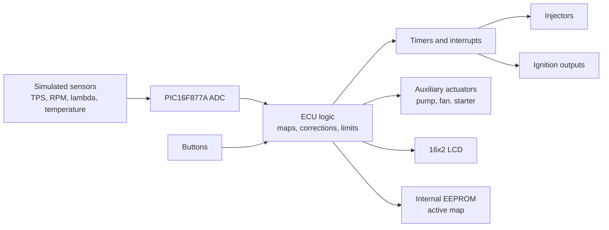

# ECU with PIC16F877A

Academic embedded systems project developed for a **Microprocessors and
Microcontrollers** course in the Computer Engineering program at UFSC. The goal
was to build an educational ECU prototype that simulates basic combustion engine
control while integrating embedded firmware, sensor acquisition, actuator
control, an LCD interface, circuit simulation, and PCB design.

> **Disclaimer:** this project is intended for academic and portfolio purposes.
> It has not been validated for real automotive use and must not be used to
> control an actual engine without proper electrical, mechanical, and safety
> reviews.

## Overview

The ECU firmware was written in C for the **PIC16F877A** microcontroller using
MPLAB X and the XC8 compiler. The system reads simulated analog sensors, applies
fuel injection maps, controls injectors, ignition outputs, auxiliary actuators,
and displays runtime data on a 16x2 LCD.

The project includes:

- Proteus circuit simulation;
- KiCad schematic and PCB design;
- economy and performance injection maps;
- active map persistence using internal EEPROM;
- button-based user interface with LCD feedback;
- timer and interrupt-driven control logic.

## Features

- ADC reading for simulated sensors:
  - TPS;
  - RPM;
  - lambda/oxygen sensor;
  - temperature.
- Two injection maps:
  - economy;
  - performance.
- Sequential injector control.
- Paired ignition output control.
- Auxiliary actuator control:
  - fuel pump;
  - radiator fan;
  - starter motor;
  - check engine LED.
- Simulated open-loop and closed-loop modes.
- RPM limiter.
- Start enrichment logic.
- Multi-screen 16x2 LCD interface.

## Architecture



## Project Structure

```text
.
├── Software-MPLab/
│   └── ecu_final.X/        # C firmware for MPLAB X / XC8
├── Hardware-Proteus/       # Circuit simulation
├── PCB-Kicad/
│   └── ecu/                # Schematic and PCB files
└── docs/                   # Technical notes and portfolio assets
```

## Technologies

- **Language:** C
- **Microcontroller:** PIC16F877A
- **IDE/Compiler:** MPLAB X + XC8
- **Simulation:** Proteus
- **PCB Design:** KiCad
- **Interface:** 16x2 LCD in 4-bit mode

## How to Open

### Firmware

1. Open `Software-MPLab/ecu_final.X` in MPLAB X.
2. Confirm that the selected device is `PIC16F877A`.
3. Build the project with the XC8 compiler.

### Simulation

1. Open `Hardware-Proteus/ecu3.pdsprj` in Proteus.
2. Attach the `.hex` file generated by MPLAB to the simulated microcontroller,
   if required.
3. Run the simulation and vary the sensor inputs to observe the ECU behavior.

### PCB

1. Open `PCB-Kicad/ecu/ecu.kicad_pro` in KiCad.
2. Review the schematic and PCB layout.
3. Run ERC/DRC before considering any manufacturing step.

## Known Limitations

This project was developed as an academic prototype. Before any use beyond
simulation, the following areas would need additional work:

- validate the electrical sizing of inductive load drivers;
- replace floating-point calculations with integer or fixed-point arithmetic to
  reduce program memory usage;
- protect variables shared between `main` and interrupt routines;
- review LCD buffers and string formatting;
- make the build reproducible outside the original MPLAB/XC8 environment;
- run and document KiCad ERC/DRC results.

## Outcome

The project was presented for the Microprocessors and Microcontrollers course
and received the maximum grade. It demonstrates practical integration between
embedded firmware, analog/digital electronics, real-time control, circuit
simulation, and PCB design.
